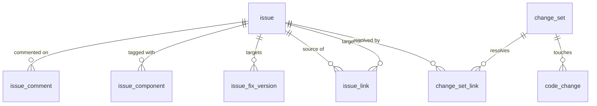
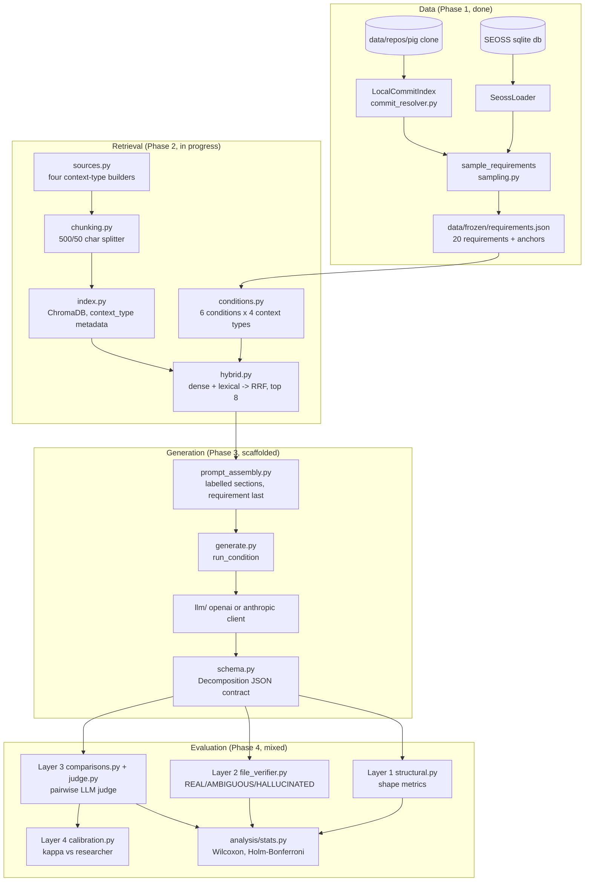

# Codebase guide

This is a longer walkthrough than `README.md`, meant to get someone from "never seen this repo"
to "can trace a requirement from the SQLite database to a scored decomposition." Read `CLAUDE.md`
first for the experimental design; this file explains how the code implements it.

## Summary

- **What this is:** a RAG pipeline that decomposes Apache Pig business requirements into
  developer-ready user stories, plus a four-layer framework that scores the output.
- **Where the data comes from:** the SEOSS 33 SQLite database (Pig's Jira history joined with its
  git history) and a real clone of `apache/pig` at `data/repos/pig`. Twenty requirements get
  sampled once and frozen to `data/frozen/requirements.json` — nothing downstream touches the
  database again.
- **What varies across runs:** each requirement is decomposed under six conditions (`vanilla`, no
  retrieval; `full_rag`, all four context types; four leave-one-out variants), so 20 × 6 = 120
  generations total. The only thing that changes between conditions is which context types hybrid
  retrieval (dense + lexical, fused with RRF) is allowed to draw from.
- **How output is scored:** every generation is a fixed `Decomposition` JSON, scored by Layer 1
  (structural shape metrics), Layer 2 (hard REAL/AMBIGUOUS/HALLUCINATED file-reference check),
  Layer 3 (pairwise LLM judge across seven fixed comparisons), and Layer 4 (researcher-vs-judge
  kappa calibration that gates whether Layer 3 counts as a primary signal).
- **Current state (see "Current status" at the end for the full list):** data layer and all
  deterministic/statistical modules are done and tested; retrieval (`sources.py`, `index.py`,
  `hybrid.py`) is in progress; generation (`generate.py`) and the judge call (`judge.py`) are still
  scaffolded.

## Understanding the database and the data structures

Before any pipeline code runs, there are two pieces of raw data on disk: the SEOSS SQLite database
and the Apache Pig git clone. Everything else in this repo — sampling, retrieval, generation,
evaluation — is built by successively reshaping what comes out of these two sources.

### The SEOSS database (`data/seoss33/pig.sqlite`)

SEOSS 33 is a pre-built extraction of Apache Pig's Jira history joined with its git history — the
`meta` table records where it came from (`jira_project` = the Apache Pig Jira, `git_project` = a
`git://git.apache.org/pig.git` clone at a specific hash, crawled 2017-11-21). It ships as one
SQLite file with nine tables, no ORM, no migrations — `SeossLoader` is the only code that should
touch it directly.

| Table              | Rows   | Key columns                                                              | What it represents |
|---------------------|-------:|---------------------------------------------------------------------------|---|
| `issue`             | 5,234  | `issue_id` (PK, e.g. `PIG-692`), `type`, `summary`, `description`, `status`, `resolution`, `created_date`, `resolved_date`, `assignee`, `reporter` | One row per Jira issue. `type` splits as Bug 3056 / Improvement 1074 / Sub-task 591 / New Feature 338 / Task 99 / Test 49 / Wish 27 — sampling filters to `New Feature` + `Improvement` (`sampling.REQUIREMENT_TYPES`). |
| `issue_comment`     | 29,896 | `issue_id` (FK), `username`, `created_date`, `message`                    | Discussion thread per issue; `_has_discussion` in `sampling.py` counts these. |
| `issue_component`   | 2,462  | `issue_id` (FK), `component`                                             | Not currently read by any loader method — available if component-level filtering is ever needed. |
| `issue_fix_version` | 4,418  | `issue_id` (FK), `fix_version`                                           | Same — unused today, present in the schema. |
| `issue_link`        | 1,479  | `source_issue_id`, `target_issue_id`, `name`, `outward_label`, `is_containment` | Self-referential many-to-many between issues. `is_containment=1` (591 rows, `name='Part-of'`) marks parent/sub-task relationships, used by `linked_issue_ids(containment_only=True)` for `reference_artefacts`. Other link types (`Reference`, `Duplicate`, `Blocker`, `dependent`, ...) exist but are only read as containment-filtered or unfiltered unions today. |
| `change_set`        | 3,134  | `commit_hash` (PK, SEOSS's own hash), `committed_date`, `message`, `author_email`, `is_merge` | One row per commit, from SEOSS's git conversion — **not** the same hash space as `data/repos/pig` (see `commit_resolver.py`). |
| `change_set_link`   | 2,980  | `commit_hash` (FK), `issue_id` (FK)                                      | The trace link: which commit(s) resolved which issue. Many-to-many in principle; `commits_for_issue()` joins through this. |
| `code_change`       | 21,143 | `commit_hash` (FK), `file_path`, `old_file_path`, `change_type`, `is_deleted`, `sum_added_lines`, `sum_removed_lines` | Per-file diff stats for each commit. `files_changed()` reads `file_path` filtered by `is_deleted`. |
| `meta`              | 4      | `key`, `value`                                                           | Provenance only (crawl timestamp, source Jira/git URLs), read via `SeossLoader.meta()`. |

Relationships, drawn as an ER sketch:



The two facts about this schema that shape the rest of the codebase:
- **Commit hashes don't match the local clone.** `change_set.commit_hash` is from SEOSS's own git
  conversion; `data/repos/pig` is a normal, separately-cloned mirror. Same commits, different
  shas. `commit_resolver.LocalCommitIndex` bridges the two by subject/author/date, not by hash
  lookup — this is why `SampledRequirement.local_commits` exists as a distinct field from
  `resolution_commit`.
- **Issue rows are the only "requirement" text there is.** There's no separate requirements
  document in SEOSS — `summary` + `description` on an `issue` row *is* the business requirement
  being decomposed, and `issue_comment` / linked sub-tasks are the closest thing to a design
  discussion trail.

### The frozen requirement (`data/frozen/requirements.json`)

Once `sample_requirements` runs against the database above, its output is flattened into plain
JSON and the database is never consulted again for the rest of the pipeline. Each of the 20
entries has this shape (real values from PIG-692):

```json
{
  "issue_key": "PIG-692",
  "title": "when running script file, automatically set up job name based on the file name",
  "description": "When running pig script from command like like this: ...",
  "resolution_commit": "98f01f5d875b6c4f83c0d5469456457865b653c8",
  "local_commits": ["afb2ec1dc3d30a761756cf4840528b40a0b2e52d", "de7c18327577f30d248ab755ac959467e32bfe2b"],
  "reference_artefacts": ["<issue description>", "<resolving commit message>"],
  "relaxation_level": 0
}
```

Field-by-field: `issue_key`/`title`/`description` are the requirement itself (what gets appended
last in every prompt); `resolution_commit` is kept only for provenance (it's a SEOSS hash, not
resolvable in the local clone); `local_commits` is what Layer 2's `FileVerifier.from_anchors`
actually windows around; `reference_artefacts` is the SQ3 human-authored comparison target (not
ground truth, "team practice" per `seoss_loader.py`); `relaxation_level` (0/1/2) records which
sampling filter tier the requirement qualified at, so the report can state how many of the 20
needed relaxation. This record is the unit everything downstream — retrieval, generation, all four
eval layers — takes as input; nothing past this file reads `issue_comment`, `issue_link`, or
`code_change` directly again.

### Table/column → `requirements.json` field mapping

Every field in the frozen record traces back to specific tables and columns, via specific
`SeossLoader` / `sampling.py` / `commit_resolver.py` calls. Nothing in this record is invented —
each value is a direct read or a deterministic derivation from the tables above.

| `requirements.json` field | Source table(s).column(s) | How it gets there |
|---|---|---|
| `issue_key` | `issue.issue_id` | Passed straight through as `SampledRequirement.issue_key`. |
| `title` | `issue.summary` | `Issue.summary` → `SampledRequirement.title` (empty string if `NULL`). |
| `description` | `issue.description` | `Issue.description` → `SampledRequirement.description`. |
| `resolution_commit` | `change_set.commit_hash`, `change_set.is_merge`, `change_set_link.issue_id`/`commit_hash`, `code_change.commit_hash` (existence check) | `sampling._acceptance_commit`: walks `commits_for_issue(issue_id)` (join of `change_set` ⋈ `change_set_link` on `commit_hash`/`issue_id`) newest-first, skips rows where `is_merge=1`, returns the first commit whose `files_changed()` (a `code_change` lookup) is non-empty. |
| `local_commits` | `change_set.message`, `change_set.author_email`, `change_set.committed_date` (of the anchor commit) — resolved against the **local git log**, not a SEOSS table | `loader.local_anchor_commits(issue_id, commit_index)` takes the anchor commit's `message`/`author_email`/`committed_date` (via `anchor_commit_obj`) and calls `LocalCommitIndex.resolve()`, which matches those three values against `git log` subject/author/date in `data/repos/pig`. Can return more than one hash (duplicate local commits of the same change). |
| `reference_artefacts` | `issue.description`; `issue_link.source_issue_id`/`target_issue_id`/`is_containment` (→ linked `issue.summary`/`description`); `change_set.message` via `commits_for_issue` | `reference_artefacts()`: starts with the issue's own `description`, appends `summary`+`description` of every issue linked with `is_containment=1` (`Part-of`), then appends the `message` of every commit in `commits_for_issue(issue_id)`. |
| `relaxation_level` | `issue_comment.issue_id` (count), `issue_link.*` (any link), `code_change` (via `files_changed` in `_acceptance_commit` above) | Not a column anywhere — it's the index of the first predicate in `sampling.predicates` the issue satisfied: level 0 needs `_has_discussion` (`issue_comment` count ≥ 2, or any `issue_link` row) **and** an acceptance commit; level 1 only needs the acceptance commit; level 2 accepts any resolved issue of the target `type`. |
| *(filter only, not stored)* | `issue.type`, `issue.resolved_date` | `issues(types=("New Feature","Improvement"), require_resolved=True)` is the candidate pool sampling draws from — these two columns decide *eligibility*, not any field value in the frozen record. |

## The experiment, as code

Twenty Apache Pig requirements are sampled from the SEOSS 33 dataset. Each one is decomposed into
a fixed JSON shape (an epic summary plus user stories) under six conditions, then scored by four
independent evaluation layers. The six conditions differ only in which of four context types
retrieval is allowed to draw from, so the only thing that varies between runs is context
composition, not the pipeline itself.



## Data flow: one requirement end to end

The diagram above shows which module calls which; this traces the actual objects that move
between them, using PIG-692 ("job name based on file name") as the running example.

**1. Rows to objects.** `SeossLoader` never exposes raw SQL rows past its own methods. A row in
`issue` becomes an `Issue` dataclass (`issue_id`, `summary`, `description`, ...); rows in
`change_set` / `change_set_link` joined on `issue_id` become `Commit` objects from
`commits_for_issue()`.

**2. Sampling resolves and freezes.** `sample_requirements` calls, per candidate issue:
`loader.local_anchor_commits(issue_id, commit_index)` → `LocalCommitIndex.resolve(subject, author,
date)` → a `list[str]` of local shas (for PIG-692: two hashes, because the local repo has a
duplicate of the same change). It also calls `loader.reference_artefacts(issue_id)` → `list[str]`
(description + linked sub-task text + resolving commit messages). Both get attached to a
`SampledRequirement` dataclass, which `utils.io.write_json` serializes straight into
`data/frozen/requirements.json`. From this point on, nothing downstream touches the SEOSS db or
`LocalCommitIndex` again — the frozen JSON is the only thing the rest of the pipeline reads for
"what is this requirement."

**3. Condition picks the context filter.** For each of the six conditions, `active_contexts(cond)`
returns a `tuple[ContextType, ...]` — e.g. `FULL_RAG` → all four, `NO_PAST_TICKETS` → the other
three, `VANILLA` → `()`. This tuple is the only thing that changes between conditions from here on.

**4. Retrieval turns text into a `dict[ContextType, list[str]]`.** For each active context type,
`hybrid_retrieve(query, active, index, top_k=8)`:
   - dense candidates: `embed_texts([query])[0]` → a 1536-dim vector → `index.dense_query(vector,
     active, top_k)`, filtered server-side by `where={"context_type": {"$in": [...]}}` → ranked
     chunk ids.
   - lexical candidates: `lexical_rank(query, candidate_texts)` → ranked chunk ids by token
     overlap, no embedding call.
   - `reciprocal_rank_fusion([dense_ids, lexical_ids], k=50)[:8]` → the final `list[str]` of chunk
     ids, resolved back to chunk text.
   The result across all active types is what `build_prompt` receives as its `retrieved` argument.

**5. Prompt assembly flattens that dict into one string.** `build_prompt(title, description,
retrieved)` → a single prompt string with labelled sections in a fixed order, empty sections
omitted, requirement always last. This string plus `SYSTEM_PROMPT` and `output_json_schema()` is
everything `run_condition` sends to the LLM.

**6. Generation turns the completion back into the schema.** `llm.complete(prompt, system=...)` →
`LLMResponse.text` (raw string, possibly fenced in ```` ```json ````) → `parse_decomposition(text)`
→ a validated `Decomposition` object (`epic_summary: str`, `user_stories: list[UserStory]`). This
one object, per (requirement, condition) pair — 20 × 6 = 120 of them — is what every evaluation
layer reads from here on; nothing downstream re-parses raw model text.

**7. Each eval layer reads the same `Decomposition` differently.**
   - Layer 1: `structural_metrics(decomp)` → a flat `dict[str, float]`, no external I/O.
   - Layer 2: every `UserStory.source_files` string → `FileVerifier.from_anchors(repo_path,
     requirement.local_commits, before=2, after=2).check(ref)` → a `FileCheck` with one of
     `REAL`/`AMBIGUOUS`/`HALLUCINATED`; `verify()` batches these into a `VerificationReport`.
   - Layer 3: `comparisons.build_ordered_comparisons(requirement_id)` → 14 `OrderedComparison`
     records (condition labels or `REFERENCE`, both presentation orders). For each, the two
     decompositions' rendered text + the requirement go into `judge.judge_pair(...)` →
     `JudgeVerdict(winner, per_criterion, rationale)`; `reconcile(ab_winner, ba_winner, ...)` turns
     the two orders of one comparison type into a single winner or `None` (positional-bias tie).
   - Layer 4: a 20-pair subset of Layer 3's judgements gets a parallel blinded researcher choice
     list; `calibration.calibrate(researcher_choices, judge_choices)` → a kappa dict.

**8. Analysis aggregates across requirements, not within one.** Per metric, the 20 paired values
(one condition vs. `FULL_RAG`) feed `wilcoxon_signed_rank` + `rank_biserial_from_pairs`; the four
SQ1 p-values (one per leave-one-out condition) go through `holm_bonferroni` together, since that is
the family the proposal corrects across.

## Directory map

```
src/
  schema.py            fixed JSON contract every layer reads
  conditions.py        6 conditions, 4 context types, which contexts each condition retrieves
  data/                SEOSS loading, commit resolution, requirement sampling
  retrieval/           chunking, context sources, ChromaDB index, hybrid dense+lexical retrieval
  pipeline/             prompt assembly + per-condition generation
  llm/                 provider-agnostic LLM client (OpenAI, Anthropic), embeddings
  eval/                the four evaluation layers
  analysis/stats.py    the pre-registered statistical procedures
  utils/               JSON/JSONL I/O, logging
prompts/               system prompt for generation, pairwise-judge template
config/config.yaml     single source of truth for models, paths, thresholds
tests/                 one test module per implemented component, fixtures over mocks
```

## Data layer (`src/data/`) — done and tested

- **`seoss_loader.py`** wraps the SEOSS SQLite schema: `issue`, `issue_comment`, `issue_link`,
  `change_set`, `change_set_link`, `code_change`. Key methods: `issues()` (filter by type/resolved),
  `comments()`, `linked_issue_ids()` (for containment/sub-task links), `commits_for_issue()`,
  `files_changed()`, and `reference_artefacts()` which assembles the SQ3 human-authored reference
  (issue description + linked sub-task text + resolving commit messages).
- **`commit_resolver.py`** (`LocalCommitIndex`) exists because SEOSS's `change_set.commit_hash`
  values come from a *different* git conversion of Pig than the real clone under
  `data/repos/pig`. Every commit is present locally, just under a different hash. Resolution
  matches by commit-subject text first, falls back to Jira-key-in-subject, then narrows by author
  email and date proximity (`max_days`). Can return several local hashes for one SEOSS commit;
  callers (Layer 2) span all of them rather than picking one.
- **`sampling.py`** (`sample_requirements`) picks 20 requirements via a three-level relaxation
  chain (design discussion + acceptance commit → acceptance commit only → any resolved issue of
  the target type), recording which level each requirement qualified at.
- Frozen output: **`data/frozen/requirements.json`**, 20 entries with `issue_key`, `title`,
  `description`, `resolution_commit` (SEOSS hash, kept for provenance), `local_commits` (resolved
  local hashes used by Layer 2), `reference_artefacts`, `relaxation_level`. The sanity subset used
  for early pipeline testing is the first three: PIG-692, PIG-699, PIG-704.

## Retrieval layer (`src/retrieval/`) — partially done

- **`chunking.py`** — thin wrapper around `RecursiveCharacterTextSplitter` (LangChain, lazy
  import), fixed at 500 chars / 50 overlap, splitting on paragraph/section boundaries first. Do
  not change these numbers; they're the proposal's fixed config.
- **`fusion.py`** — `reciprocal_rank_fusion`, done and tested. Fuses any number of ranked lists by
  `1 / (k + rank)`, `k=50`, ties broken by first-seen order for determinism.
- **`sources.py`** *(new)* — one builder per context type, each returning `Chunk` records
  (`id`, `text`, `context_type`, `metadata`) ready for chunking and indexing:
  - `past_tickets_chunks` — issue title + description via `SeossLoader`.
  - `design_document_chunks` — Forrest XML docs under
    `data/repos/pig/src/docs/src/documentation/content/xdocs/`, text extracted with
    `xml.etree.ElementTree` (not treated as markdown, since it's structured XML).
  - `coding_convention_chunks` — `data/repos/pig/test/checkstyle.xml` + top-level `README.txt`,
    kept as raw text (not XML-parsed) because checkstyle's descriptive value lives mostly in its
    XML *comments*, which `ElementTree` silently drops.
  - `codebase_summary_chunks` — one LLM summary per `.java` file under
    `data/repos/pig/src/org/apache/pig/` (the real test tree lives in a separate top-level `test/`
    directory, so scoping to `src/org` already excludes it). Summaries are cached to disk keyed by
    file path so re-runs never re-call the model; a full-corpus pass (1088 files) always prints a
    count and waits for explicit confirmation before spending API calls.
- **`index.py`** (`ContextIndex`) — single ChromaDB collection, every chunk tagged with a
  `context_type` metadata field so one collection serves all four types and every ablation
  condition filters by `context_type: {"$in": [...]}` rather than needing four separate indexes.
  Embeddings come from `text-embedding-3-small` (`llm/openai_client.py:embed_texts`).
- **`hybrid.py`** — dense candidates from `index.dense_query`, lexical candidates from the local
  token-overlap `lexical_rank`, fused with `reciprocal_rank_fusion`, top 8 returned
  (`TOP_K = 8`, matches `config.yaml: retrieval.top_k`). The `active` context types passed in are
  exactly `conditions.active_contexts(condition)` — this is the mechanism that makes the six
  conditions "the same call, different filter."

## Conditions (`src/conditions.py`) — done and tested

Four context types (`ContextType`): `PAST_TICKETS`, `DESIGN_DOCS`, `CODING_CONVENTIONS`,
`CODEBASE_SUMMARIES`. Six conditions (`Condition`): `VANILLA` (no retrieval at all), `FULL_RAG`
(all four types), and one leave-one-out condition per context type. `CONDITION_CONTEXTS` maps each
condition to the tuple of types it may retrieve from; `active_contexts(condition)` is the lookup
everything else (hybrid retrieval, generation) calls.

## Pipeline (`src/pipeline/`) — assembly done, generation scaffolded

- **`prompt_assembly.py`** (`build_prompt`) renders retrieved chunks under labelled section
  headings (`PAST TICKETS`, `DESIGN DOCUMENTS`, ...) in a fixed display order, omitting empty
  sections, with the requirement always appended last. This is what keeps the six conditions'
  prompts structurally identical except for which sections are populated.
- **`generate.py`** (`run_condition`) is the TODO: retrieve per `active_contexts(condition)` →
  `build_prompt` → `llm.complete(SYSTEM_PROMPT + output_json_schema())` →
  `parse_decomposition(raw_text)`. `parse_decomposition` already strips ```` ```json ```` fences
  and validates against the Pydantic `Decomposition` model.

## LLM clients (`src/llm/`) — done

`base.py` defines the provider-agnostic `LLMClient` ABC with retry/backoff; `temperature` is fixed
and recorded per the proposal's discipline (same generator temperature across all six conditions).
`openai_client.py` and `anthropic_client.py` are thin adapters, both with lazy SDK imports so
neither package is required until actually used. `embed_texts` (in `openai_client.py`) is the
embedding entry point `index.py` calls.

## Schema (`src/schema.py`) — done and tested

`Decomposition` (epic summary + `UserStory` list) is the Pydantic contract every layer reads.
`UserStory.is_well_formed` checks the role/goal/benefit template via regex (Layer 1 input).
`Decomposition.dangling_dependencies()` finds story-id references that don't resolve within the
same decomposition. `output_json_schema()` derives the JSON Schema handed to the model from the
same Pydantic model, so the validated contract and the prompted contract cannot drift apart.

## Evaluation layers (`src/eval/`)

- **Layer 1 — `structural.py`** (done, tested): pure shape metrics computed from a
  `Decomposition` — story count, well-formedness rate, average acceptance criteria, file-reference
  specificity (regex-detects a path-like or extension-like reference vs. a generic gesture),
  inter-story dependency rate, dangling-dependency count. Explicitly diagnostic, not a quality
  score.
- **Layer 2 — `file_verifier.py`** (done, tested): classifies every file reference against a real
  git tree as `REAL` / `AMBIGUOUS` (right basename, wrong/partial path) / `HALLUCINATED` (no match
  at all) — deliberately hard categories, no soft "plausible" bucket. `FileVerifier.from_anchors`
  unions the commit windows (`resolve_commit_window`, `before`/`after` from `config.yaml`) around
  however many local commits an issue resolved to, since one SEOSS commit can map to several local
  hashes. **Note:** there is a duplicate copy of this file at the workspace root
  ([file_verifier.py](file_verifier.py)) — the canonical, imported one is
  [src/eval/file_verifier.py](src/eval/file_verifier.py); the root copy looks like a stray leftover
  worth deleting or ignoring.
- **Layer 3 — `comparisons.py`** (done, tested) **+ `judge.py`** (scaffolded): `comparisons.py`
  builds the fixed seven comparison types per requirement (4 leave-one-out-vs-full-RAG for SQ1, 1
  vanilla-vs-full-RAG for SQ2, 2 vs-reference for SQ3), each in both presentation orders (14
  ordered judgements total), and `reconcile()` returns `None` when the two orders disagree
  (positional bias) rather than forcing a winner. `judge.py:judge_pair` is the TODO: render
  `prompts/judge_pairwise.txt` with both outputs and the requirement, call the judge LLM, parse
  per-criterion (`actionability`, `completeness`, `project_specificity`, `granularity`, `clarity`)
  and overall winners. The judge must stay a different model family from the generator
  (`config.yaml`: generator is OpenAI, judge is Anthropic) to avoid self-enhancement bias, and it
  is pairwise by design — do not switch it to independent Likert scoring, which saturates.
- **Layer 4 — `calibration.py`** (done, ready to consume real data): `calibrate()` runs
  `analysis.stats.cohens_kappa` between researcher and judge choices over a 20-pair subset and
  flags `layer3_validated` against `KAPPA_THRESHOLD = 0.6`. Layer 3 only counts as a primary
  quality signal once this passes; below threshold, report Layer 3 descriptively only.

## Analysis (`src/analysis/stats.py`) — done and tested

- `wilcoxon_signed_rank` — paired test per metric per SQ1 comparison (SciPy, lazy import).
- `rank_biserial_from_pairs` — effect size reported alongside every Wilcoxon result, since n=20
  gives modest power and a clean null is still a reportable result.
- `holm_bonferroni` — step-down correction across the four SQ1 per-metric tests.
- `cohens_kappa` — Layer 4 agreement with an approximate 95% CI (scikit-learn, lazy import).
- `_rankdata` is a local tie-aware ranking helper so the effect-size calculation doesn't need
  SciPy just for that.

## Conventions worth knowing before touching this code

- Python 3.11, type hints everywhere, Pydantic for structured data, `pathlib` over string paths.
- Provider SDKs (`openai`, `anthropic`, `chromadb`, `langchain_text_splitters`) are imported lazily
  inside the function/method that needs them, never at module top level, so importing e.g.
  `src.schema` never requires an API key or an installed SDK.
- New deterministic logic ships with tests against real fixtures (a throwaway git repo for the
  file verifier, real XML/text samples for retrieval), not mocks.
- No soft middle ground on Layer 2 categories, no switching the Layer 3 judge to Likert scoring,
  no changing `chunking.py`'s 500/50 config or `fusion.py`'s RRF — these are methodology decisions
  from the proposal, not implementation details.

## Running things

```bash
cd thesis-code
python -m venv .venv && source .venv/bin/activate
pip install -r requirements.txt
cp .env.example .env        # OPENAI_API_KEY / ANTHROPIC_API_KEY
pytest -q                   # all implemented modules
```

If a test that shells out to `git` fails with `fatal: unable to access '~/.gitconfig'`, that's a
sandboxed-terminal artifact (some sandboxes hide parts of `$HOME`), not a code bug — rerun with
full filesystem access.

## Current status (see `CLAUDE.md` for the authoritative build order)

Done and tested: `schema.py`, `conditions.py`, `retrieval/fusion.py`, `retrieval/chunking.py`,
`pipeline/prompt_assembly.py`, `eval/file_verifier.py`, `eval/structural.py`,
`eval/comparisons.py`, `analysis/stats.py`, `data/seoss_loader.py`, `data/sampling.py`,
`data/commit_resolver.py`. In progress: `retrieval/sources.py`, `retrieval/index.py`,
`retrieval/hybrid.py` (item #2 in the build order). Still scaffolded: `pipeline/generate.py`,
`eval/judge.py`; `eval/calibration.py` is ready and just needs real researcher-vs-judge choices.
